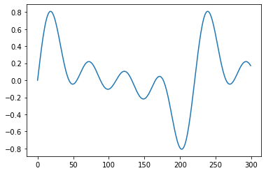

# recode
Make codecs for fixed size structured chunks serialization and deserialization of
sequences, tabular data, and time-series.

To install:	```pip install recode```

# Functionality

his notebook shows various examples of recode and it how it can be used with:
- Single channel numerical streams
- Multi-channel numerical streams
- DataFrames
- Iterators


```python
from recode import (ChunkedEncoder, 
                    ChunkedDecoder, 
                    MetaEncoder, 
                    MetaDecoder, 
                    IterativeDecoder, 
                    StructCodecSpecs, 
                    specs_from_frames,
                    frame_to_meta,
                    meta_to_frame)
```

## Quick run through

First define the frame you want to encode


```python
frame = [1,2,3]
```

Next define the specifications for that encoding


```python
specs = StructCodecSpecs(chk_format='h')
specs
```


    StructCodecSpecs(chk_format='h', n_channels=1, chk_size_bytes=2)


Next define an encoder and encode your frame to bytes


```python
encoder = ChunkedEncoder(frame_to_chk=specs.frame_to_chk)
b = encoder(frame)
b
```


    b'\x01\x00\x02\x00\x03\x00'


Once you need your original frame again, define a decoder and decode your frame


```python
decoder = ChunkedDecoder(specs.chk_to_frame)
decoded_frames = list(decoder(b))
decoded_frames
```


    [1, 2, 3]


## Step-by-step explanation

### Define your StructCodecSpecs

StructCodecSpecs is used to define the specs for making codecs for fixed size structured chunks serialization and deserialization of sequences, tabular data, and time-series. This definition is based on format strings of the [python struct module](https://docs.python.org/3/library/struct.html#format-strings).

There are two ways to define StructCodecSpecs, the first being to explicitly define it using the StructCodecSpecs class. StructCodecSpecs takes three arguments: `chk_format`, `n_channels`, and `chk_size_bytes`. Only `chk_format` is required, as `n_channels` and `chk_size_bytes` can be determined based on `chk_format`. If `n_channels` is given, then `chk_format` should only contain one format character, as it will be assumed that all channels have the same data type. If this is not the case, then do not provide an argument for `n_channels` and instead pass a string with the format character matching the data type for each channel in the frame to `chk_format`. For example if the first channel contains integers and the second contains floats, then `chk_format = 'hd'`.


```python
frame = [1,2,3]
specs = StructCodecSpecs(chk_format='h')
specs
```


    StructCodecSpecs(chk_format='h', n_channels=1, chk_size_bytes=2)


The second way to define StructCodecSpecs is to use `specs_from_frames` which will implictly define StructCodecSpecs based on the frame that is going to be encoded/decoded. This function will return a tuple containing an iterator of the passed frame and the defined StructCodecSpecs. The first element of the tuple can be ignored if the frame passed is not an iterator.


```python
_, specs = specs_from_frames(frame)
specs
```


    StructCodecSpecs(chk_format='h', n_channels=1, chk_size_bytes=2)


If frame is an iterator, then redefine frame as the first argument of the tuple so the first element of frame is not lost for encoding.


```python
frame = iter([[1,2], [3,4]])
frame, specs = specs_from_frames(frame)
specs, list(frame)
```


    (StructCodecSpecs(chk_format='hh', n_channels=2, chk_size_bytes=4),
     [[1, 2], [3, 4]])


### Define your Encoder

Your Encoder will allow you to, you guessed it, encode your frames! There are two Encoders currently defined in recode: `ChunkedEncoder` and `MetaEncoder`.

`ChunkedEncoder` should be your goto encoder for sequences, while `MetaEncoder` works best for tabular data (currently must be in the format of list of dicts).


```python
frame = [1,2,3]
_, specs = specs_from_frames(frame)
encoder = ChunkedEncoder(frame_to_chk=specs.frame_to_chk)
b = encoder(frame)
b
```

    b'\x01\x00\x02\x00\x03\x00'


When using a `MetaEncoder`, an extra argument named frame_to_meta is required, which can be easily imported from recode!


```python
frame = [{'foo': 1, 'bar': 1}, {'foo': 2, 'bar': 2}, {'foo': 3, 'bar': 4}]
_, specs = specs_from_frames(frame)
encoder = MetaEncoder(frame_to_chk=specs.frame_to_chk, frame_to_meta=frame_to_meta)
b = encoder(frame)
b
```

    b'\x07\x00foo.bar\x01\x00\x01\x00\x02\x00\x02\x00\x03\x00\x04\x00'


### Define your Decoder

Next up your Decoder will allow you to decode your encoded bytes. There are three Encoders currently defined in recode: `ChunkedDecoder`, `IterativeDecoder`, and `MetaDecoder`.

Either `ChunkedDecoder` or `IterativeDecoder` will work well for sequences, with the only difference being that `IterativeDecoder` returns an iterator of decoded chunks while `ChunkedDecoder` returns a mapping which can be converted to an iterable. `MetaDecoder` works best for tabular data encoded with `MetaEncoder`. 


```python
frame = [1,2,3]
_, specs = specs_from_frames(frame)
encoder = ChunkedEncoder(frame_to_chk=specs.frame_to_chk)
decoder = ChunkedDecoder(specs.chk_to_frame)
b = encoder(frame)
list(decoder(b))
```

    [1, 2, 3]


As is shown in the following example, an `IterativeDecoder` will return an unpack_iterator which which can easily be converted to a standard iterable like a list, or be used as an iterator.


```python
frame = [[1,1],[2,2]]
_, specs = specs_from_frames(frame)
encoder = ChunkedEncoder(frame_to_chk=specs.frame_to_chk)
decoder = IterativeDecoder(chk_to_frame=specs.chk_to_frame)
b = encoder(frame)
iter_frames = decoder(b)
print(type(iter_frames))
next(iter_frames), next(iter_frames)
```

    <class 'unpack_iterator'>
    ((1, 1), (2, 2))


When using a `MetaDecoder`, an extra argument named meta_to_frame is required, which can be easily imported from recode!


```python
frame = [{'foo': 1, 'bar': 1}, {'foo': 2, 'bar': 2}, {'foo': 3, 'bar': 4}]
_, specs = specs_from_frames(frame)
encoder = MetaEncoder(frame_to_chk=specs.frame_to_chk, frame_to_meta=frame_to_meta)
decoder = MetaDecoder(chk_to_frame=specs.chk_to_frame, meta_to_frame=meta_to_frame)
b = encoder(frame)
decoded_frames = decoder(b)
decoded_frames
```

    [{'foo': 1, 'bar': 1}, {'foo': 2, 'bar': 2}, {'foo': 3, 'bar': 4}]


## Encoding a waveform

### Create a synthetic waveform using `hum`


```python
from hum.gen.sine_mix import freq_based_stationary_wf
import matplotlib.pyplot as plt
import numpy as np

DFLT_N_SAMPLES = 21 * 2048
DFLT_SR = 44100
```


```python
wf_mix = freq_based_stationary_wf(freqs=(200, 400, 600, 800), weights=None,
                             n_samples = DFLT_N_SAMPLES, sr = DFLT_SR)
plt.plot(wf_mix[:300]);
```


    

    


```python
wf_mix
```


    array([0.        , 0.07114157, 0.14170624, ..., 0.49480205, 0.54853009,
           0.5979443 ])


### Encode the wf


```python
specs = StructCodecSpecs('d')
encoder = ChunkedEncoder(frame_to_chk=specs.frame_to_chk)
decoder = ChunkedDecoder(chk_to_frame=specs.chk_to_frame)
b = encoder(wf_mix)
b[:100]
```


    b'\x00\x00\x00\x00\x00\x00\x00\x00\x1b:\x11\x8dU6\xb2?\xb8!\xa2\x15n#\xc2?\xe6I\xedz\x15\x06\xcb?L;\xe6\xfah\xd8\xd1?}\x8c\x9b\x9a\xf5\x08\xd6?D\xcc\xf1\x897\x0c\xda?\xe3\xc5\xbeb/\xda\xdd?DE\xb6K\xb6\xb5\xe0?\x82|\xfcz\x90\\\xe2?\xae3:$\x99\xde\xe3?\x1e\x95\xbe\xef$9\xe5?\x81\xd7\xdc\xec'


### Decode and compare to wf_mix


```python
decoded_wf_mix = decoder(b)
plt.plot(decoded_wf_mix[:300]);
```


    

    


```python
np.all(decoded_wf_mix == wf_mix)
```


    True


## Encoding a pandas dataframe


```python
import pandas as pd
```

### Create/import your dataframe


```python
df = pd.DataFrame(data = [[1,2,3],[4,5,6]], columns = ['foo', 'bar', 'set'])
df
```


<div>
<table border="1" class="dataframe">
  <thead>
    <tr style="text-align: right;">
      <th></th>
      <th>foo</th>
      <th>bar</th>
      <th>set</th>
    </tr>
  </thead>
  <tbody>
    <tr>
      <th>0</th>
      <td>1</td>
      <td>2</td>
      <td>3</td>
    </tr>
    <tr>
      <th>1</th>
      <td>4</td>
      <td>5</td>
      <td>6</td>
    </tr>
  </tbody>
</table>
</div>


### Prep the dataframe for encoding


```python
frame = df.to_dict('records')
frame
```


    [{'foo': 1, 'bar': 2, 'set': 3}, {'foo': 4, 'bar': 5, 'set': 6}]


### Encode the list of dicts


```python
_, specs = specs_from_frames(frame)
encoder = MetaEncoder(frame_to_chk=specs.frame_to_chk, frame_to_meta=frame_to_meta)
decoder = MetaDecoder(chk_to_frame=specs.chk_to_frame, meta_to_frame=meta_to_frame)
b = encoder(frame)
b
```


    b'\x0b\x00foo.bar.set\x01\x00\x02\x00\x03\x00\x04\x00\x05\x00\x06\x00'


```python
decoded_frame = decoder(b)
decoded_frame
```


    [{'foo': 1, 'bar': 2, 'set': 3}, {'foo': 4, 'bar': 5, 'set': 6}]


```python
decoded_df = pd.DataFrame(decoded_frame)
print(np.all(decoded_df == df))
decoded_df
```

    True


<div>
<table border="1" class="dataframe">
  <thead>
    <tr style="text-align: right;">
      <th></th>
      <th>foo</th>
      <th>bar</th>
      <th>set</th>
    </tr>
  </thead>
  <tbody>
    <tr>
      <th>0</th>
      <td>1</td>
      <td>2</td>
      <td>3</td>
    </tr>
    <tr>
      <th>1</th>
      <td>4</td>
      <td>5</td>
      <td>6</td>
    </tr>
  </tbody>
</table>
</div>


## Miscellaneous information

### Byte order, Size, and Alignment

This table provides the characters associated with Byte order, Size, and Alignment. If one of these characters is not given as the first character of the format string, then `@` will be assumed. More information about Byte order, Size, and Alignment can be found [here](https://docs.python.org/3/library/struct.html#byte-order-size-and-alignment).

|Character|Byte order|Size|Alignment|
|---------|----------|----|---------|
|@|native|native|native|
|=|native|standard|none|
|<|little-endian|standard|none|
|>|big-endian|standard|none|
|!|network (=big-endian)|standard|none|


# Full Examples

## Single channel numerical stream

```python
from recode import StructCodecSpecs, ChunkedEncoder, ChunkedDecoder
specs = StructCodecSpecs(chk_format='h')
encoder = ChunkedEncoder(frame_to_chk=specs.frame_to_chk)
decoder = ChunkedDecoder(chk_to_frame=specs.chk_to_frame)
frames = [1, 2, 3]
b = encoder(frames)
assert b == b'\x01\x00\x02\x00\x03\x00'
decoded_frames = list(decoder(b))
assert decoded_frames == frames
```


## Multi-channel numerical stream
```python
from recode import StructCodecSpecs, ChunkedEncoder, ChunkedDecoder
specs = StructCodecSpecs(chk_format='@h', n_channels = 2)
encoder = ChunkedEncoder(frame_to_chk=specs.frame_to_chk)
decoder = ChunkedDecoder(chk_to_frame=specs.chk_to_frame)
frames = [(1, 2), (3, 4), (5, 6)]
b = encoder(frames)
assert b == b'\x01\x00\x02\x00\x03\x00\x04\x00\x05\x00\x06\x00'
decoded_frames = list(decoder(b))
assert decoded_frames == frames
```


## Iterative decoder
```python
from recode import StructCodecSpecs, ChunkedEncoder, IterativeDecoder
specs = StructCodecSpecs(chk_format = 'hdhd')
encoder = ChunkedEncoder(frame_to_chk = specs.frame_to_chk)
decoder = IterativeDecoder(chk_to_frame = specs.chk_to_frame)
frames = [(1,1.1,1,1.1),(2,2.2,2,2.2),(3,3.3,3,3.3)]
b = encoder(frames)
iter_frames = decoder(b)
assert next(iter_frames) == frames[0]
next(iter_frames)
```    

	(2, 2.2, 2, 2.2)


## DataFrame (as list of dicts) using MetaEncoder/MetaDecoder
```python
from recode import StructCodecSpecs, MetaEncoder, MetaDecoder, frame_to_meta, meta_to_frame
data = [{'foo': 1.1, 'bar': 2.2}, {'foo': 513.23, 'bar': 456.1}, {'foo': 32.0, 'bar': 6.7}]
specs = StructCodecSpecs(chk_format='d', n_channels = 2)
encoder = MetaEncoder(frame_to_chk = specs.frame_to_chk, frame_to_meta = frame_to_meta)
decoder = MetaDecoder(chk_to_frame = specs.chk_to_frame, meta_to_frame = meta_to_frame)
b = encoder(data)
assert decoder(b) == data
```


## Implicitly define codec specs based on frames

```python
from recode import specs_from_frames, ChunkedEncoder, ChunkedDecoder
frames = [1,2,3]
_, specs = specs_from_frames(frames)
encoder = ChunkedEncoder(frame_to_chk = specs.frame_to_chk)
decoder = ChunkedDecoder(chk_to_frame=specs.chk_to_frame)
b = encoder(frames)
assert b == b'\x01\x00\x02\x00\x03\x00'
decoded_frames = list(decoder(b))
decoded_frames
```

	[1, 2, 3]


## Implicit definition of iterator
```python
from recode import specs_from_frames, ChunkedEncoder, IterativeDecoder
frames = iter([[1.1,2.2],[3.3,4.4]])
frames, specs = specs_from_frames(frames)
encoder = ChunkedEncoder(frame_to_chk = specs.frame_to_chk)
decoder = ChunkedDecoder(chk_to_frame=specs.chk_to_frame)
b = encoder(frames)
decoded_frames = list(decoder(b))
assert decoded_frames == [(1.1,2.2),(3.3,4.4)]
```

# More

[Example of recode functionality to read and write audio files](https://github.com/otosense/recode/wiki/Example-of-recode-functionality-to-read-and-write-audio-files)


